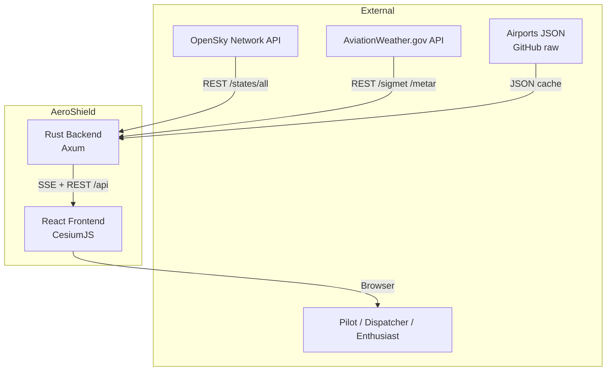
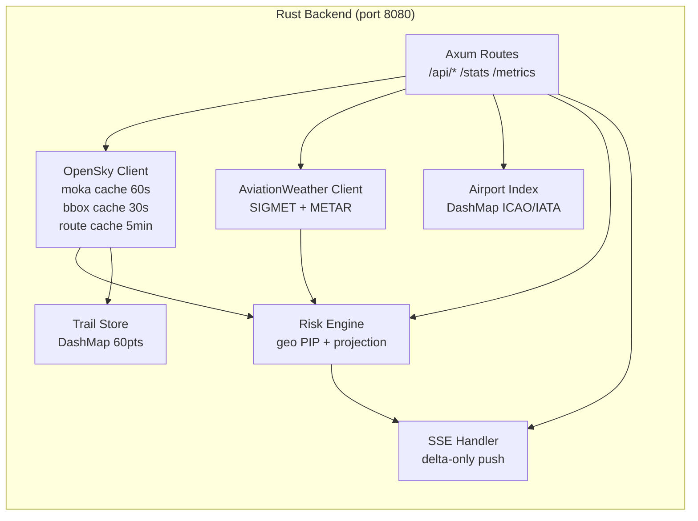
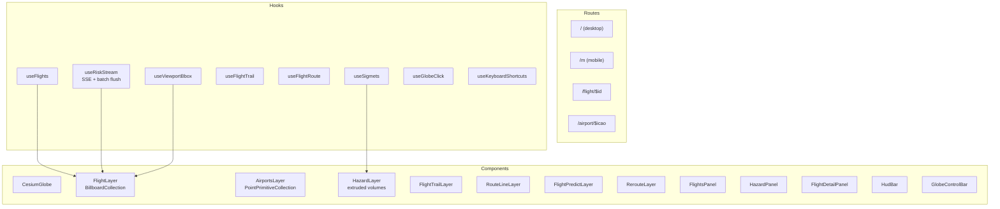
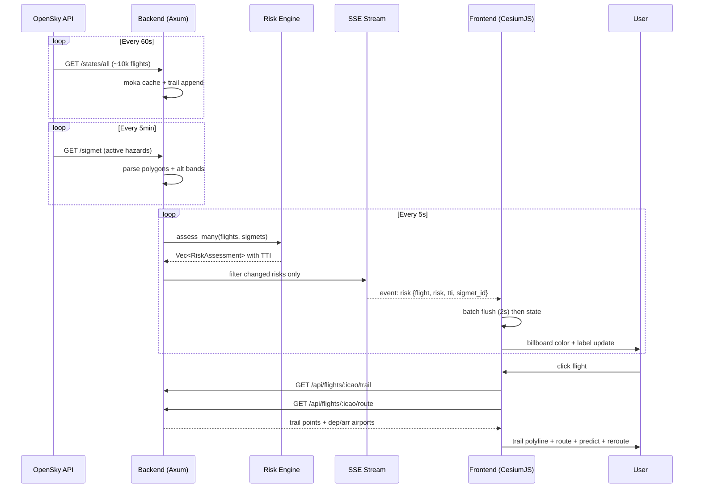
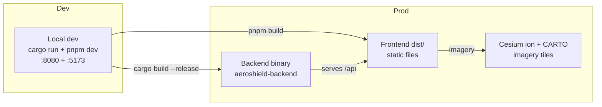

# Architecture — AeroShield 3D

> System architecture documentation. For API reference see [API.md](./API.md).
> For UML diagrams see [DIAGRAMS.md](./DIAGRAMS.md).

## 1. Overview

AeroShield 3D is a **real-time 3D aviation hazard awareness platform**. It ingests
live flight positions from OpenSky Network and active SIGMET weather hazards from
AviationWeather.gov, runs a spatial risk engine in Rust, and streams risk
assessments to a CesiumJS 3D globe frontend via Server-Sent Events.

```
[OpenSky Network]      [AviationWeather.gov]
        |                       |
        v                       v
+------------------------------------------+
|         Rust Backend (Axum)              |
|  OpenSky client (moka cache, 60s)        |
|  AviationWeather client (5min refresh)   |
|  Airports index (DashMap, ~10k entries)  |
|  Risk engine (geo PIP + altitude band)   |
|  Trail store (DashMap, 60 pts/flight)   |
|  SSE delta stream (changed risks only)   |
+------------------------------------------+
                    |
                    | SSE (event: risk)
                    v
+------------------------------------------+
|         React + Vite Frontend            |
|  CesiumJS 3D globe (resium)              |
|  BillboardCollection (imperative)        |
|  TanStack Query + Router                 |
|  shadcn/ui tactical HUD theme            |
|  Mobile /m route (bottom-sheet)          |
+------------------------------------------+
```

## 2. C4 Model

### Level 1 — System Context



### Level 2 — Container Diagram



### Level 3 — Component Diagram (Frontend)



## 3. Key Architectural Decisions

| Decision | Rationale | ADR |
|----------|-----------|-----|
| SSE over WebSocket | Unidirectional risk push; no client-to-server messages needed; simpler Axum integration | [ADR-001](./adr/ADR-001-sse-over-websocket.md) |
| Cesium primitive collections over resium Entities | React reconciliation of 10k+ entities caused severe lag; GPU-batched primitives are O(1) per item | [ADR-002](./adr/ADR-002-primitive-collections.md) |
| moka cache for OpenSky | 400 req/day anonymous limit requires aggressive caching at multiple layers (global, bbox, route) | [ADR-003](./adr/ADR-003-moka-caching.md) |
| Delta-only SSE push | Pushing all risks every 5s flooded the frontend; only changed risks are now sent | [ADR-004](./adr/ADR-004-sse-delta-push.md) |
| Dedicated /m mobile route | Desktop tactical panels don't fit 375px; separate layout with bottom-sheet is cleaner than responsive overrides | [ADR-005](./adr/ADR-005-mobile-route.md) |
| geo crate for spatial | Pure-Rust point-in-polygon; no external GIS dependency; well-tested | [ADR-006](./adr/ADR-006-geo-crate.md) |

## 4. Data Flow



## 5. Deployment



The backend serves the pre-built frontend `dist/` in production (or a reverse
proxy can split traffic). No database is required — all state is in-memory with
periodic API polling.

## 6. Non-Functional Requirements

| Requirement | Target | Implementation |
|-------------|--------|----------------|
| Flight data freshness | < 90s | 60s poll + moka cache + `updated_at` stamp |
| Risk latency | < 10s from fetch to UI | 5s SSE cycle + 2s batch flush |
| Render performance | 60fps with 200 flights + 30k airports | Primitive collections, GPU-batched |
| OpenSky rate limit | < 400 req/day | moka global+bbox+route cache, 429 backoff |
| Mobile usability | Works on 375px viewport | Dedicated /m route, touch controls |
| Uptime | Stateless restart | All state in-memory; cold start < 10s |
