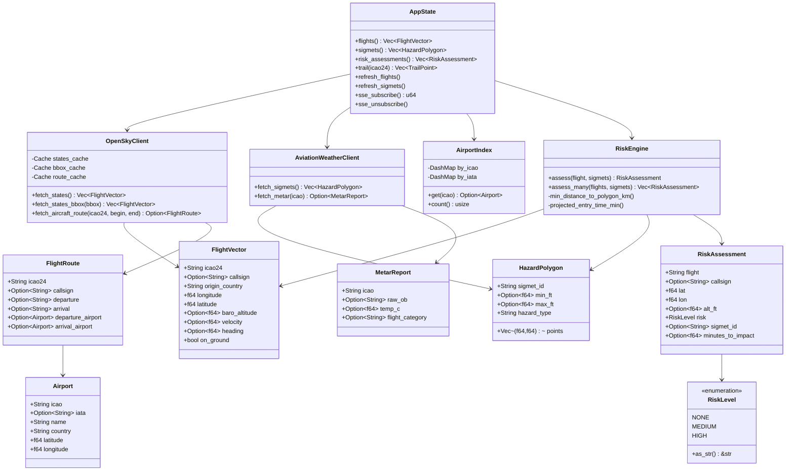
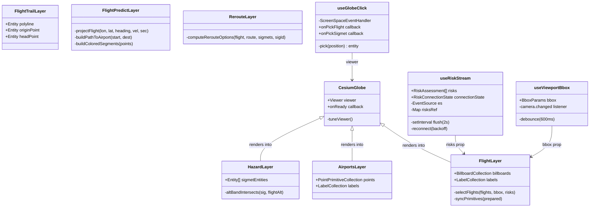
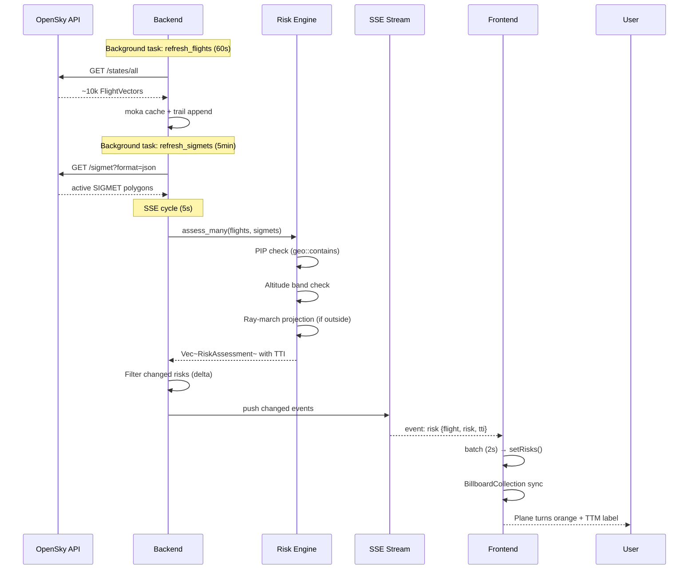
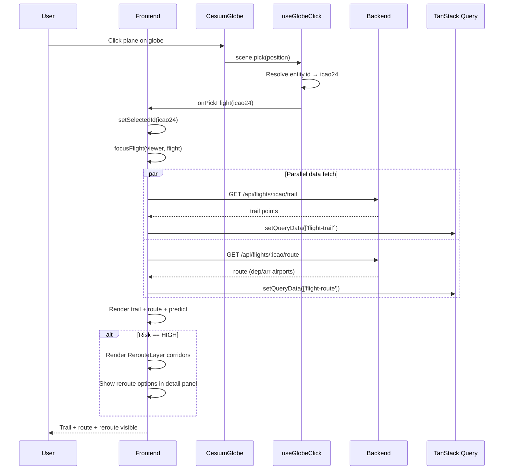
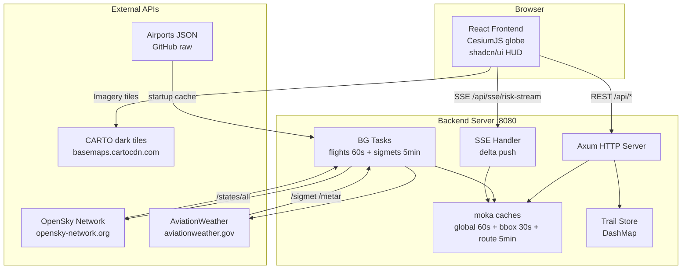
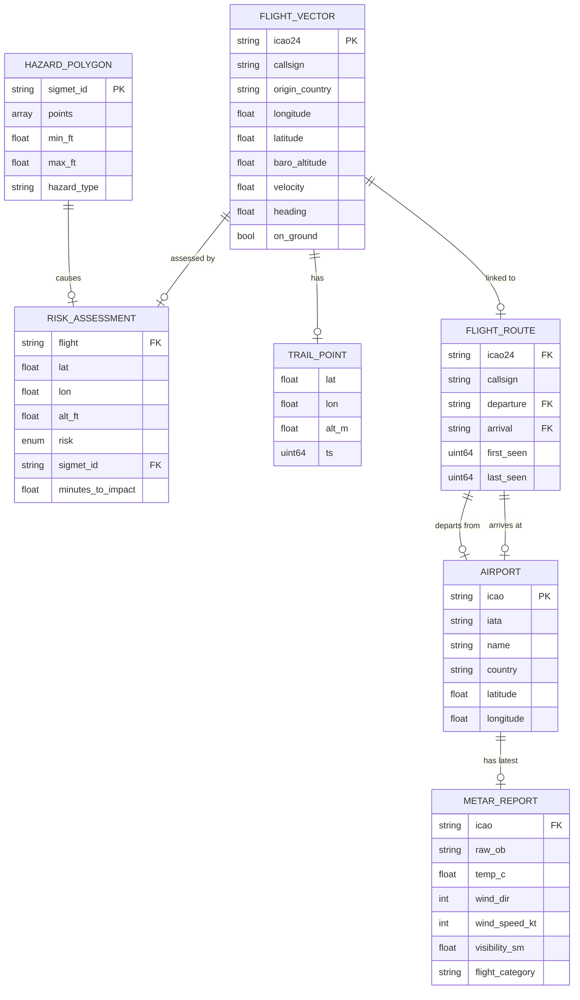
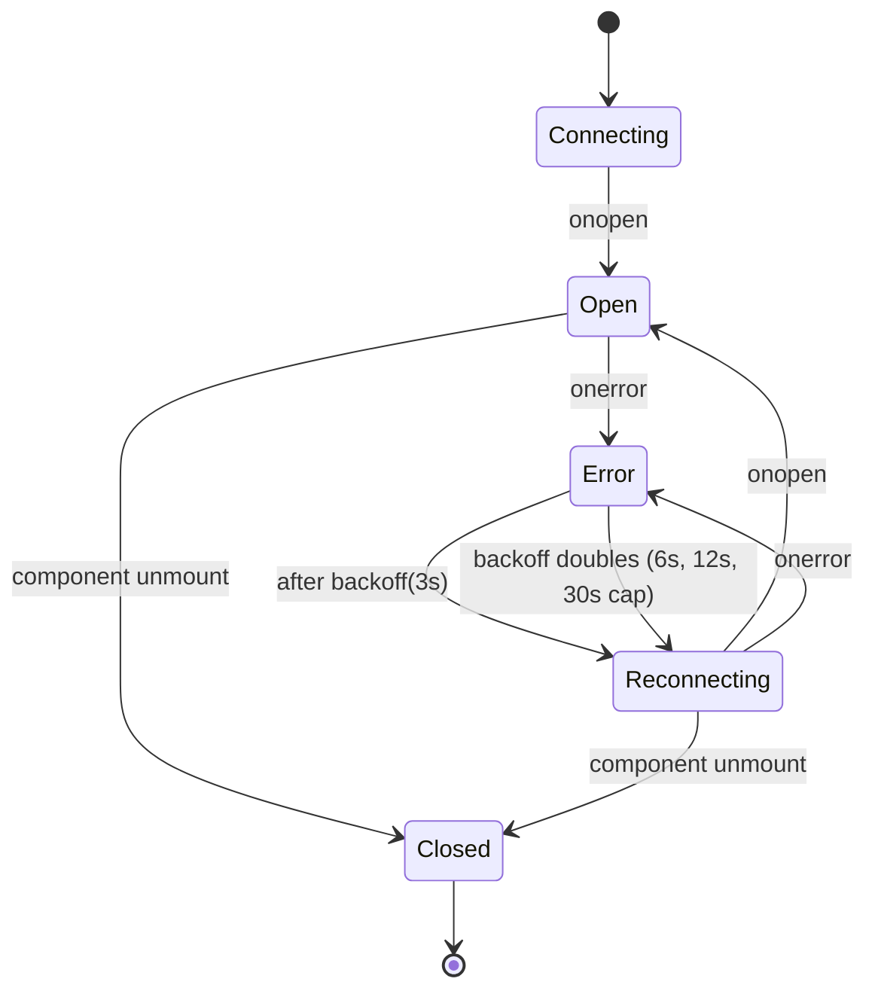

# UML Diagrams — AeroShield 3D

> All diagrams use [Mermaid](https://mermaid.js.org/) syntax.
> Render in GitHub, VS Code (Mermaid extension), or [mermaid.live](https://mermaid.live).

---

## 1. Class Diagram — Backend

---

## 2. Class Diagram — Frontend

---

## 3. Sequence Diagram — Risk Assessment Flow

---

## 4. Sequence Diagram — Flight Selection

---

## 5. Deployment Diagram

---

## 6. Entity Relationship Diagram

---

## 7. State Machine — SSE Connection

